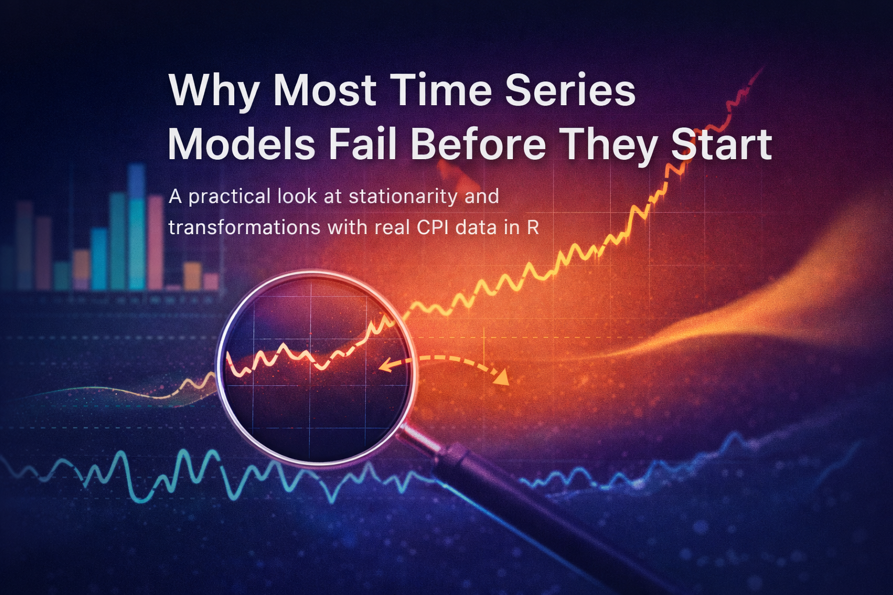

{fig-align="center"}

## A model can run and still be fundamentally wrong

Many time series models fail before they even begin. Not because the software crashes. Not because the code is wrong. But because the data entering the model violate one of the most important assumptions in time series analysis: **stationarity**.

This is where many analyses quietly go off the rails. A model is estimated, forecasts are produced, coefficients look serious, and the graphs appear convincing. But the model may be chasing a moving target rather than learning a stable data-generating mechanism.

In this post, we will work with a real macroeconomic series rather than a toy example. The data come from the **Consumer Price Index for All Urban Consumers: All Items (CPIAUCSL)**, published by the U.S. Bureau of Labor Statistics and distributed through FRED. FRED describes CPIAUCSL as a monthly, seasonally adjusted price index and notes that percent changes in the index are commonly used to measure inflation.

Because live API access may fail in some institutional or offline environments, this workflow uses a **locally downloaded CSV file** instead of fetching the series on the fly. You can download the file directly from the [CPIAUCSL page on FRED](https://fred.stlouisfed.org/series/CPIAUCSL).

The goal is simple: show why raw time series levels often mislead us, what stationarity really means, and why transformations such as differencing and log-differencing are not cosmetic tricks but conceptual necessities.

## What stationarity really means

In informal language, a stationary series is one whose behavior does not drift in a systematic way over time. More formally, a weakly stationary process ($X_t$) satisfies three conditions:

$$
E(X_t) = \mu
$$

$$
Var(X_t) = \sigma^2
$$

$$
Cov(X_t, X_{t-k}) = \gamma_k
$$

The first condition says the mean does not change over time. The second says the variance is constant. The third says the covariance between observations depends only on the lag (k), not on calendar time itself.

This matters because a large part of classical time series modeling is built on the idea that the stochastic structure is stable. When that structure is drifting, many familiar tools become unreliable or at least much harder to interpret. A trending series can generate strong autocorrelation even when the underlying dynamic structure is weak. A persistent upward path can trick the analyst into seeing “model fit” where the model is merely inheriting inertia from the level of the series.

Put differently: without stationarity, a model may explain movement without actually explaining the mechanism.

## Load the CPI data from a CSV file

Download the CSV file for **CPIAUCSL** from the official FRED series page and save it in your working directory with the name `CPIAUCSL.csv`. The file typically includes the columns `observation_date` and `CPIAUCSL`. FRED is the distribution platform, while the source agency for the series is the U.S. Bureau of Labor Statistics.

```{r}
library(readr)
library(dplyr)
library(ggplot2)
library(tibble)
library(zoo)
library(scales)
library(patchwork)
library(tseries)

cpi_tbl <- read_csv("CPIAUCSL.csv", show_col_types = FALSE) %>%
  transmute(
    date = as.Date(observation_date),
    cpi  = as.numeric(CPIAUCSL)
  ) %>%
  arrange(date) %>%
  filter(!is.na(date), !is.na(cpi))

cpi_tbl %>% slice_head(n = 5)
```

The line `filter(!is.na(date), !is.na(cpi))` is important. If your CSV has an `NA` for a month such as October 2025, that observation is safely excluded from the analysis instead of silently breaking the workflow.

## Start with the visual story, not the test statistic

In time series analysis, the first serious diagnostic is often visual rather than formal. That is not because tests are unimportant. It is because plots let us see the basic character of the data before we start compressing everything into a p-value.

If a series has a visible trend, changing volatility, sudden level shifts, or unusual gaps, that already tells us something about whether a stationary model is likely to behave well.

### The raw CPI level

```{r}
p_level <- ggplot(cpi_tbl, aes(x = date, y = cpi)) +
  geom_line(linewidth = 0.9, color = "#1B4965") +
  labs(
    title = "U.S. CPI (CPIAUCSL): level series",
    subtitle = "Monthly, seasonally adjusted index from FRED",
    x = NULL,
    y = "Index"
  ) +
  scale_y_continuous(labels = label_number()) +
  theme_minimal(base_size = 12)

p_level
```

Even before applying a formal statistical test, the visual pattern already tells us something important. The CPI level series does not oscillate around a stable mean; instead, it follows a persistent upward path over time. This alone raises an immediate warning against modeling the raw level series as if it were stationary.

The graph also suggests that the increase is not perfectly uniform across the entire sample. In some periods, the slope becomes steeper, indicating faster price growth, while in others the series evolves more gradually. In other words, the series appears to contain not only a long-run trend but also changes in inflation dynamics over time.

This is precisely why visual inspection should be the first step in time series analysis. Before looking at test statistics or fitting a model, we should ask a simpler question: does the series *look* like it fluctuates around a constant level? In this case, the answer is clearly no.

A smooth and steadily rising curve may look statistically innocent at first glance, but in practice it is often a sign that the raw series is carrying trend information that must be addressed before modeling.

### Rolling summaries to deepen the visual diagnosis

A single line plot is useful, but local summaries make the visual argument sharper. Below, I compute a 24-month rolling mean and rolling standard deviation.

```{r}
cpi_roll <- cpi_tbl %>%
  mutate(
    roll_mean_24 = zoo::rollmean(cpi, k = 24, fill = NA, align = "right"),
    roll_sd_24   = zoo::rollapply(cpi, width = 24, FUN = sd, fill = NA, align = "right")
  )

p_roll_mean <- ggplot(cpi_roll, aes(date, roll_mean_24)) +
  geom_line(linewidth = 0.9, color = "#2A9D8F") +
  labs(
    title = "24-month rolling mean of CPI",
    x = NULL,
    y = "Rolling mean"
  ) +
  theme_minimal(base_size = 12)

p_roll_sd <- ggplot(cpi_roll, aes(date, roll_sd_24)) +
  geom_line(linewidth = 0.9, color = "#E76F51") +
  labs(
    title = "24-month rolling standard deviation of CPI",
    x = NULL,
    y = "Rolling SD"
  ) +
  theme_minimal(base_size = 12)

p_roll_mean / p_roll_sd
```

If the series were approximately stationary, we would expect these rolling statistics to fluctuate around relatively stable levels over time. In particular, the rolling mean should remain close to a constant value, and the rolling standard deviation should not exhibit systematic shifts.

However, the evidence here points in the opposite direction. The rolling mean shows a clear and persistent upward drift, reinforcing what we observed in the raw series: the central tendency is not stable, but evolving over time.

The rolling standard deviation tells a more nuanced story. While it remains relatively moderate for long periods, there are noticeable fluctuations and, more importantly, a pronounced spike in recent years. This indicates that the variability of the series is not constant and may respond to underlying economic conditions or shocks.

Taken together, these two plots suggest that the series violates the key assumptions of stationarity—both in terms of mean and variance. While rolling statistics alone do not formally prove non-stationarity, they provide strong visual evidence that the raw series is not suitable for direct modeling without transformation.

## Why raw CPI levels are a good example

CPI is ideal for illustrating this problem because the level series typically trends upward over time. That is not a defect in the data; it is what a price index often does. But from a modeling perspective, it creates trouble.

If the level keeps drifting upward, then the mean is not constant. If the size of movements changes as the level rises, the variance may also appear unstable. In such a setting, fitting a model directly to the raw series can mix long-run inflationary drift with short-run dynamic behavior.

Economically, analysts are usually not interested in the index level itself as much as they are interested in **inflation**, that is, the rate at which the price level changes. Statistically, this is convenient too, because transforming the series from levels to changes often brings it closer to stationarity.

## A statistical check: the Augmented Dickey-Fuller test

Visual diagnosis matters, but it is usually not enough. A commonly used statistical tool is the **Augmented Dickey-Fuller (ADF) test**, which tests for the presence of a unit root. In practical terms, the test is often used to assess whether a series behaves like a non-stationary process with persistent stochastic trend.

The null hypothesis of the ADF test is that the series has a unit root. That means the burden of proof is asymmetric:

-   a **large** p-value means we do **not** have strong evidence against non-stationarity,
-   a **small** p-value means the data are more consistent with stationarity.

That distinction is easy to say and easy to misuse. Failing to reject the null is not the same thing as proving a series is non-stationary beyond all doubt. It simply means the test did not find enough evidence against the unit-root view.

Let us start with the raw CPI level.

```{r}
adf_level <- tseries::adf.test(cpi_tbl$cpi)
adf_level
```

The Augmented Dickey–Fuller (ADF) test provides a formal way to assess whether the series contains a unit root. The null hypothesis of the test is that the series is non-stationary (i.e., it has a unit root), while the alternative hypothesis is stationarity.

In this case, the p-value is extremely high (p ≈ 0.99), meaning that we fail to reject the null hypothesis. In other words, there is no statistical evidence to support that the CPI level series is stationary.

However, this result should not be interpreted in isolation. Statistical tests and visual diagnostics should complement each other. The high p-value is entirely consistent with what we observed earlier: the series exhibits a strong upward trend and does not fluctuate around a constant mean.

Taken together, both the visual evidence and the ADF test point to the same conclusion — the raw CPI level behaves more like a drifting (unit root) process than a stationary one. This reinforces the need for transforming the series before attempting any meaningful modeling.

## The first rescue: differencing

One of the oldest and most important ideas in time series analysis is that differencing can remove certain forms of trend. The first difference is

$$
\Delta X_t = X_t - X_{t-1}
$$

This transformation asks a different question. Instead of modeling the level, we model the change from one period to the next.

```{r}
cpi_diff_tbl <- cpi_tbl %>%
  mutate(diff_cpi = c(NA, diff(cpi))) %>%
  filter(!is.na(diff_cpi))

p_diff <- ggplot(cpi_diff_tbl, aes(x = date, y = diff_cpi)) +
  geom_line(linewidth = 0.8, color = "#6D597A") +
  labs(
    title = "First difference of CPI",
    subtitle = "Absolute month-to-month change in the index",
    x = NULL,
    y = expression(Delta*CPI)
  ) +
  theme_minimal(base_size = 12)

p_diff
```

Taking the first difference removes a large part of the visible trend in the series. Compared to the raw CPI level, the differenced series fluctuates much more around a relatively stable center, which is an encouraging sign from a modeling perspective.

However, differencing does not fully solve the problem. While it helps stabilize the mean, the variability of the series still appears to change over time, particularly in more recent periods where larger fluctuations are observed. This suggests that the series may still violate the constant variance assumption.

There is also a more subtle but important issue: interpretation. The first difference represents absolute changes in the index, not relative ones. In macroeconomic data, a one-point increase in CPI does not carry the same meaning when the index is around 100 versus when it exceeds 300. As the scale of the series grows, the same absolute change reflects a smaller proportional movement.

In other words, differencing improves the statistical properties of the series, but it does not yet provide a fully consistent or interpretable measure of change. This is why we often go one step further and consider transformations based on relative (percentage) changes.

## The more meaningful rescue: log differences

This is where the log transformation becomes more than a technical detail. Consider

$$
\Delta \log(X_t) = \log(X_t) - \log(X_{t-1})
$$

For moderate changes, this is approximately the proportional growth rate. In the CPI context, it moves us from the language of index levels toward the language of inflation.

That shift is both statistical and economic.

```{r}
cpi_log_tbl <- cpi_tbl %>%
  mutate(
    log_cpi = log(cpi),
    dlog_cpi = c(NA, diff(log_cpi)),
    annualized_inflation_pct = 1200 * dlog_cpi,
    yoy_inflation_pct = 100 * (cpi / lag(cpi, 12) - 1)
  )

p_dlog <- cpi_log_tbl %>%
  filter(!is.na(annualized_inflation_pct)) %>%
  ggplot(aes(x = date, y = annualized_inflation_pct)) +
  geom_line(linewidth = 0.8, color = "#D62828") +
  labs(
    title = "Monthly log-difference of CPI (annualized)",
    subtitle = "A close cousin of short-run inflation",
    x = NULL,
    y = "Percent"
  ) +
  theme_minimal(base_size = 12)

p_yoy <- cpi_log_tbl %>%
  filter(!is.na(yoy_inflation_pct)) %>%
  ggplot(aes(x = date, y = yoy_inflation_pct)) +
  geom_line(linewidth = 0.8, color = "#F4A261") +
  labs(
    title = "Year-over-year CPI inflation",
    subtitle = "A slower-moving inflation measure",
    x = NULL,
    y = "Percent"
  ) +
  theme_minimal(base_size = 12)

p_dlog / p_yoy
```

Two key insights emerge from these transformations.

First, moving from levels to rates of change fundamentally improves interpretability. The log-difference series represents approximate percentage changes — in this context, a close proxy for short-run inflation. This is the quantity economists actually care about. A 1% increase has the same meaning regardless of whether the index is at 100 or 300, making comparisons over time much more meaningful.

Second, the transformation has a clear impact on the statistical properties of the series. Compared to the raw level and even the first difference, the log-differenced series fluctuates more consistently around a stable mean. While it still exhibits volatility spikes and occasional outliers, the overall behavior is much closer to what we would expect from a stationary process.

The comparison between the two plots is also instructive. The monthly log-difference captures short-term fluctuations and reacts quickly to shocks, while the year-over-year inflation series smooths out this noise and highlights longer-term inflation dynamics. Both are useful, but they answer different questions.

To put it bluntly: you did not just transform the data — you changed the question.

## Re-test after transformation

Let us apply the ADF test again, this time to the log-differenced series.

```{r}
adf_dlog <- cpi_log_tbl %>%
  filter(!is.na(dlog_cpi)) %>%
  pull(dlog_cpi) %>%
  tseries::adf.test()

adf_dlog
```

The contrast between the two ADF test results is striking and highly informative.

For the raw CPI level, we failed to reject the null hypothesis of a unit root, indicating that the series behaves as a non-stationary process. In contrast, for the log-differenced series, the p-value drops to around 0.01, allowing us to reject the null hypothesis and conclude that the transformed series is consistent with stationarity.

This shift is not just a technical detail — it reflects a fundamental change in how the data behaves. The transformation has effectively removed the persistent trend component and brought the series closer to a stable statistical structure.

That said, the test result should always be interpreted alongside the visual evidence. The ADF test provides formal confirmation, but the intuition comes from the plots. What we saw visually — a drifting level series versus a mean-reverting transformed series — is now supported by statistical testing.

In essence, the workflow comes full circle:\
we start with a problematic series, diagnose the issue visually, apply a transformation, and then verify the improvement formally.

This is the core of time series thinking.

## A subtle but crucial point: transformation changes interpretation

This is the point where many explanations remain superficial.

When you difference a series, you are not merely “cleaning” it — you are redefining the object of analysis.

-   Modeling **CPI levels** asks how the price index evolves over time.
-   Modeling **first differences** asks how much the index changes from one period to the next.
-   Modeling **log differences** asks about proportional change, which is directly linked to inflation.

These are not equivalent statistical questions, and they are certainly not equivalent economic questions.

This is why time series preprocessing should never be treated as a mechanical step. Every transformation involves a trade-off: it improves certain statistical properties while simultaneously altering the meaning of the data.

Understanding that trade-off is not optional — it is central to sound time series analysis.

## Why this matters for ARIMA-style modeling

ARIMA models are often presented as if the workflow were mechanical: inspect the series, difference if needed, identify orders, estimate parameters, check residuals, and forecast. While this workflow is useful, it can create the misleading impression that differencing is simply a procedural step — a box to tick.

It is not.

Differencing is a deliberate modeling choice. Its purpose is to separate persistent, trend-like behavior from shorter-run dynamics. If you skip it when it is needed, your model may inherit non-stationarity and produce unreliable or misleading inference. If you apply it excessively, you risk removing meaningful structure and end up modeling noise.

The real question, therefore, is not “Should I difference?” but rather:\
**What feature of the data am I trying to stabilize, and what question do I want the model to answer?**

## A compact comparison

## A compact comparison

| Series version        | What it represents               | Typical issue                    | When it helps (and when it does not)                         |
|-----------------|-----------------|-----------------|----------------------|
| CPI level             | The price index itself           | Strong trend, likely unit root   | Poor starting point for stationary modeling                  |
| First difference      | Absolute period-to-period change | Still scale-dependent            | Reduces trend, but interpretation remains limited            |
| Log difference        | Approximate proportional change  | May still show volatility bursts | More suitable for modeling inflation-type dynamics           |
| Year-over-year change | Annual percentage change         | Smoother, less responsive        | Useful for communication, less suited for short-run analysis |

## Common mistakes

Most mistakes in time series analysis are not computational — they are conceptual.

**Mistake 1: fitting models directly to raw levels because the plot “looks smooth.”**\
Smoothness is not stationarity. A strong trend can produce visually smooth series that are statistically problematic.

**Mistake 2: treating differencing as a harmless default.**\
Differencing changes the meaning of the data. It may improve statistical properties while quietly reducing interpretability if applied without care.

**Mistake 3: relying on a single test result as final truth.**\
The ADF test is useful, but it is only one piece of evidence. Visual inspection, domain knowledge, structural breaks, and alternative tests all matter.

**Mistake 4: forgetting the economics.**\
In the case of CPI, the focus is typically on inflation, not the index level itself. A good transformation is one that improves statistical validity while remaining aligned with the economic question.

Taken together, these mistakes point to a simple lesson:\
**time series analysis is not about applying steps — it is about making informed choices.**

## Final thoughts

Most time series models do not fail because we cannot estimate them. They fail because we model the wrong object.

The raw CPI series is a clear reminder that not every observed series is ready for modeling. A trending index is rarely an appropriate input for a stationary model. Once we difference — and especially log-difference — the data, the series becomes more interpretable, more stable, and much closer to the type of process that classical time series methods are designed to handle.

So before asking whether your model is sophisticated enough, ask a more fundamental question:

**Am I modeling a stable process — or just chasing drift?**

In many cases, the answer to this question matters far more than whether you choose AR(1), ARIMA(1,1,1), or any other fashionable specification.

## References and further reading

### Data sources

-   FRED, Federal Reserve Bank of St. Louis. *Consumer Price Index for All Urban Consumers: All Items (CPIAUCSL).*\
    <https://fred.stlouisfed.org/series/CPIAUCSL>

-   FRED API documentation. *St. Louis Fed Web Services: FRED® API.*\
    <https://fred.stlouisfed.org/docs/api/fred/>

------------------------------------------------------------------------

### Core time series references

-   Box, G. E. P., Jenkins, G. M., Reinsel, G. C., & Ljung, G. M. (2015). *Time Series Analysis: Forecasting and Control.* Wiley.

-   Hyndman, R. J., & Athanasopoulos, G. (2021). *Forecasting: Principles and Practice (3rd ed.).*\
    <https://otexts.com/fpp3/>

-   Hamilton, J. D. (1994). *Time Series Analysis.* Princeton University Press.

------------------------------------------------------------------------

### Stationarity and unit root testing

-   Dickey, D. A., & Fuller, W. A. (1979). *Distribution of the estimators for autoregressive time series with a unit root.* Journal of the American Statistical Association.

-   Said, S. E., & Dickey, D. A. (1984). *Testing for unit roots in autoregressive-moving average models of unknown order.* Biometrika.

------------------------------------------------------------------------

### Transformations and interpretation

-   Stock, J. H., & Watson, M. W. (2019). *Introduction to Econometrics.* Pearson.

-   Tsay, R. S. (2010). *Analysis of Financial Time Series.* Wiley.

------------------------------------------------------------------------

### Practical R resources

-   R Core Team. *R: A Language and Environment for Statistical Computing.*\
    <https://www.r-project.org/>

-   Hyndman, R. J. et al. *forecast package documentation.*\
    <https://pkg.robjhyndman.com/forecast/>

------------------------------------------------------------------------

### Suggested next steps for readers

If you want to go deeper, consider exploring:

-   Unit root tests beyond ADF (KPSS, Phillips–Perron)
-   Structural breaks and regime changes
-   Seasonal differencing and SARIMA models
-   Volatility modeling (ARCH/GARCH)

These topics build directly on the ideas discussed in this article and will deepen your understanding of time series behavior.
